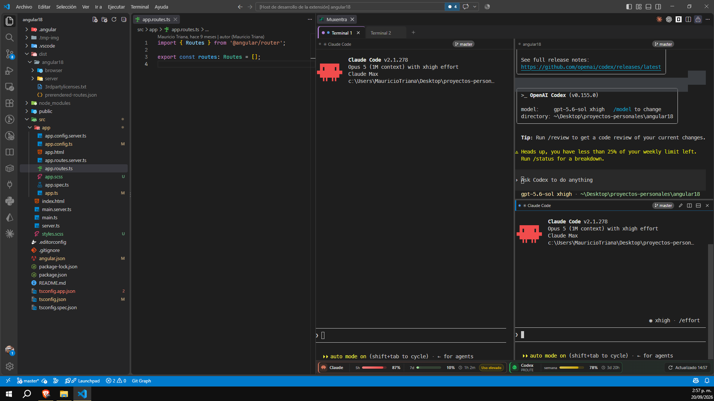
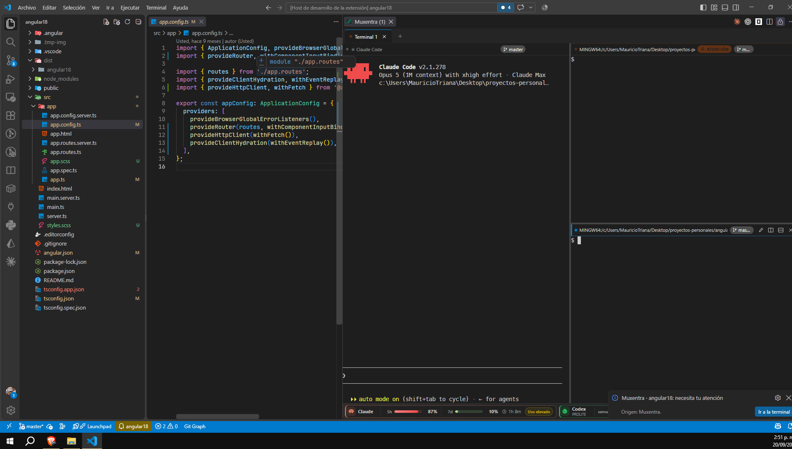

<p align="center">
  
</p>

<h1 align="center">Muxentra</h1>

<p align="center">
  A VS Code extension that puts tabs, nested terminal splits and AI assistant usage in a single workspace.
</p>



## Requirements

- VS Code 1.100 or newer. It also runs in Cursor and Windsurf, which are built on the same base.
- Windows 10 and 11 is where it is used day to day, and macOS is supported as well, image pasting included, with less mileage behind it. Linux is not supported yet: `node-pty` 1.1.0 ships no prebuilt binary for it and the terminal server never starts.
- The folder has to be trusted. Muxentra opens shells using the workspace configuration, so it does not even activate in Restricted Mode.

## Installation

On Windows, from PowerShell:

```powershell
irm https://raw.githubusercontent.com/Mauricio320/muxentra/main/install.ps1 | iex
```

It grabs the latest release, verifies its hash and installs it into whichever editor it finds (`code`, Insiders, Cursor or Windsurf). The same command updates it later: an extension installed from a `.vsix` does not update itself.

If you would rather do it by hand, or PowerShell refuses to run the script, download the `.vsix` from the Releases tab and run:

```
code --install-extension muxentra-0.3.0.vsix
```

Reload the window (`Ctrl+Shift+P` > "Developer: Reload Window") and that is it. To confirm it is installed, `code --list-extensions` should list `mauriciotriana.muxentra`; to remove it, `code --uninstall-extension mauriciotriana.muxentra`.

## First steps

1. `Ctrl+Alt+T` opens the panel. It takes its own editor group on the right, with one terminal ready.
2. Split it: `Ctrl+\` to the right, `Ctrl+Shift+\` downwards. Drag the dividers to share out the space, or run "Muxentra: Igualar tamaño de terminales" from the command palette.
3. `Ctrl+Shift+T` opens another tab. `F2` renames it, right-click colours it, and `Shift+F2` renames the focused terminal.
4. Drag a terminal by its header to rearrange it: drop it in the middle of another one and they swap, drop it near an edge and it moves to that side.
5. `Ctrl+Shift+W` closes the focused terminal. Closing the panel, reloading the window or quitting VS Code kills nothing: the processes stay alive and every terminal comes back with whatever it was running.

With several agents running at once you do not have to watch them: each terminal marks itself when it finishes or when it needs you, and the number of waiting terminals shows up in the VS Code status bar.

> Heads up: the extension's own interface (command titles, setting descriptions, notifications) is in Spanish.

## What it does

- A "Muxentra" panel in the editor area with its own tab bar.
- Each tab holds a tree of splits: any terminal can be split to the right or downwards, nested as deep as you want.
- Draggable dividers between terminals, and a command to even out their sizes.
- Drag a terminal by its header: dropping it in the middle of another one swaps them; dropping it near an edge (left, right, top, bottom) moves it to that side. Escape cancels the drag.
- Every terminal can be renamed (double-click its name or press `Shift+F2`). A hand-written name wins over the title the shell reports and travels with the terminal when you move it. Clearing it restores the automatic title.
- Every tab can be given a colour (right-click the tab) so you can find it at a glance.
- Every terminal shows what it is up to: a pulsing blue dot while it works, a green "listo" label when it finishes, an orange "atención" one when the program is asking for something. The dot is repeated on the tab, the number of waiting terminals appears in the panel title and in the VS Code status bar, and a notification offers to take you there. Built for having four agents running and knowing which one needs you.
- A bottom bar with Claude Code and OpenAI Codex usage: the percentage of each limit window and how long until it resets. Click to refresh.
- Every terminal shows the git branch of the directory it sits in. It understands worktrees, so two terminals in different worktrees show different branches. On a detached HEAD it shows the short sha, highlighted.
- `Ctrl+Alt+V` (`Cmd+Alt+V` on macOS) pastes images: the clipboard image is saved into `.muxentra-img/` inside the project and its path is typed into the terminal, ready to hand to an agent.
- Opening the panel creates a dedicated group on the right and locks it, so files keep opening in the main editor. The position survives a window restore. Unlock it with the VS Code padlock or with the `muxentra.lockEditorGroup` setting.
- Tabs and their layout are saved per workspace.
- Shells run in a separate terminal server, a process independent from VS Code. Closing the panel, reloading the window or quitting VS Code does not kill them: when you come back, each terminal reconnects to its process and shows what it had (Claude, Codex, a dev server, whatever was running). If the server is gone (first use, machine reboot), fresh shells are started.
- "Muxentra: Cerrar todas las terminales" kills every process on the server, including those belonging to other windows.
- It uses the same shell as your default VS Code profile (`terminal.integrated.defaultProfile`), Git Bash included.
- Colours and font are taken from the theme and from your integrated terminal settings.

## Shortcuts (with the panel focused)

| Action | Windows / Linux | macOS |
| --- | --- | --- |
| Open the panel (global) | `Ctrl+Alt+T` | `Cmd+Alt+T` |
| New tab | `Ctrl+Shift+T` | `Cmd+T` |
| Next / previous tab | `Ctrl+Shift+]` / `Ctrl+Shift+[` | `Cmd+Shift+]` / `Cmd+Shift+[` |
| Rename tab | `F2` or double-click | `F2` or double-click |
| Rename terminal | `Shift+F2` or double-click its name | `Shift+F2` or double-click |
| Tab colour | right-click the tab | right-click the tab |
| Split right | `Ctrl+\` | `Cmd+\` |
| Split down | `Ctrl+Shift+\` | `Cmd+Shift+\` |
| Close terminal | `Ctrl+Shift+W` (and `Ctrl+W` outside the terminal text) | `Cmd+W` |
| Next / previous terminal | `Ctrl+Alt+→` / `Ctrl+Alt+←` | `Cmd+Alt+→` / `Cmd+Alt+←` |
| Copy / paste | `Ctrl+Shift+C` / `Ctrl+Shift+V` (also `Ctrl+V`) | `Cmd+C` / `Cmd+V` |
| Paste image from the clipboard | `Ctrl+Alt+V` | `Cmd+Alt+V` |

"Muxentra: Igualar tamaño de terminales" and "Muxentra: Ir a la terminal que espera" live in the command palette with no default shortcut. Every shortcut can be changed in Keyboard Shortcuts (VS Code adapts them to your keyboard layout).

Closing the last terminal of a tab closes the tab. Middle-clicking a tab closes it.

## Pasting an image into the terminal

This is for handing a screenshot to an agent running in the terminal, such as Claude Code or Codex: they do not read the clipboard, but they do open a file path, and that is what this shortcut gives them.

1. Copy the image. A screen clipping (`Win+Shift+S`), a "Copy image" from the browser, or a `.png` file copied from Explorer all work.
2. Click the terminal you want it in.
3. Press `Ctrl+Alt+V`, or `Cmd+Alt+V` on macOS.
4. The path is typed into the command line, with a trailing space so you can keep writing:

   ```
   .muxentra-img/img-20260920-154101.png
   ```

5. Add your question next to it and hit Enter:

   ```
   .muxentra-img/img-20260920-154101.png why does this button overflow its container on mobile?
   ```

Worth knowing:

- The image is saved in `.muxentra-img/`, at the root of the project. You can change that with `muxentra.imagePasteDir`, as long as it stays inside the workspace.
- It is a staging folder, not an album: the 6 most recent images are kept (`muxentra.imagePasteMax`) and pasting a new one deletes the oldest ones over the limit.
- Pasting the same image twice does not create two files: the contents are compared and the existing file is reused, with the same path.
- It never reaches the repository. The folder is ignored by writing `.muxentra-img/` into `.git/info/exclude`, a rule local to your clone: it does not show up in `git status` and nobody else sees it. In a worktree the rule goes into the common `.git`.
- If the clipboard holds no image, it tells you and creates nothing. `Ctrl+V` and `Ctrl+Shift+V` still paste text as always.
- How the clipboard is read: on Windows, with `System.Windows.Forms.Clipboard` from Windows PowerShell, the only one that runs in STA mode; on macOS, with AppleScript through `osascript`, which converts the clipboard to PNG and also understands a file copied in Finder. On Linux the shortcut says it is unavailable.
- On Windows, `Ctrl+Alt` is AltGr on Spanish and Latin American keyboards, but AltGr+V types no character, so the shortcut costs you nothing: `@`, `{`, `}`, `[`, `]`, `|` and `~` still reach the terminal.

## Settings

- `muxentra.shellPath` and `muxentra.shellArgs`: an explicit shell. Empty means your default VS Code profile.
- `muxentra.fontFamily` and `muxentra.fontSize`: when empty they come from `terminal.integrated.*` or `editor.*`.
- `muxentra.scrollback`: lines of history per terminal.
- `muxentra.showUsage`: show or hide the bottom usage bar.
- `muxentra.agentStatus`: turn the per-terminal status tracking on or off.
- `muxentra.notifyOn`: when VS Code notifies you. `all` (the default) on finish and on attention, `attention` only when the program asks for something, `none` never.
- `muxentra.attentionSound`: a short beep when a terminal asks for attention. Off by default.
- `muxentra.quietSeconds`: seconds of silence after which a busy terminal counts as finished. Defaults to 3.
- `muxentra.showBranch`: show or hide the git branch on each terminal.
- `muxentra.lockEditorGroup`: lock the editor group when the panel opens.
- `muxentra.usageRefreshSeconds`: how often usage is re-read while the panel is visible.
- `muxentra.imagePasteDir`: folder for pasted images. Defaults to `.muxentra-img`. It has to stay inside the workspace.
- `muxentra.imagePasteMax`: how many pasted images are kept. Defaults to 6.
- `muxentra.multiLinePasteWarning`: ask for confirmation before pasting multi-line text. On by default.

`muxentra.shellPath` and `muxentra.shellArgs` have `machine` scope: they are set per machine or per user, and a repository cannot change them from its `.vscode/settings.json`.

## If something goes wrong

- **The installer says it cannot find `code`.** Open the palette (`Ctrl+Shift+P`), run "Shell Command: Install 'code' command in PATH" and launch it again.
- **PowerShell refuses to run the script.** Download the `.vsix` from the release and install it with `code --install-extension`, which does exactly the same thing.
- **Installed, but nothing shows up.** Reload the window (`Ctrl+Shift+P` > "Developer: Reload Window") and open the panel with `Ctrl+Alt+T`.
- **The panel opens but no terminal starts.** Check the Output view, "Muxentra" channel: it says why the shell or the server failed.
- **`Ctrl+Alt+V` does nothing.** The clipboard holds no image (copy it again), or you are on Linux, where it is not supported. On macOS the shortcut is `Cmd+Alt+V`.
- **Fresh shells started when I reopened VS Code.** The server shuts itself down after five minutes with no live terminals and no open panels; if nothing was running, that is expected.
- **A shortcut does not respond.** Another extension may be taking it: look it up in Keyboard Shortcuts by typing "muxentra" and reassign it.

If something really breaks, open an issue with whatever the Output > "Muxentra" channel says.

## Where the Claude and Codex usage comes from

Everything is read from disk, read-only, with no network calls and no credentials.

- **Codex**: the last `rate_limits` event of the most recent session file in `~/.codex/sessions`, which carries the used percentage of each window and when it resets.
- **Claude**: `~/.claude/vscode-claude-status-cache.json`, the cache written by the Claude Code status extension out of the API limit headers. It is the only local source with the real plan percentage. If it is missing or stale, the tokens of the last 5 hours are summed from the transcripts in `~/.claude/projects` instead.

When a source is unavailable, that item simply does not appear.

## How it knows whether a terminal is working, done, or asking for you

Nothing to configure and no hooks to install: it is inferred from what the terminal writes on screen, so it works the same with Claude Code, Codex, Gemini CLI, aider, a build or a dev server.



- **Working**: the terminal produces sustained output, at least three bursts in two seconds. An agent thinking repaints its spinner several times per second. The echo of what you type does not count.
- **Done**: it was working and has been quiet for `muxentra.quietSeconds`. It is only flagged if the work lasted more than four seconds, so an `ls` does not notify you.
- **Attention**: the program asked for it explicitly, through the terminal bell or through a desktop notification sequence (`OSC 9` or `OSC 777`). The bell that closes title sequences does not count: this uses the xterm parser, not a text search.

The label always appears; the notification and the waiting count do not. If you had that terminal in front of you when it changed state, it is flagged silently. Looking at a terminal clears it, and so does typing in it.

To make Claude Code ring the bell the moment it needs permission, set `"preferredNotifChannel": "terminal_bell"` in `~/.claude/settings.json`. Codex does the same through `tui.notifications` in `~/.codex/config.toml`. Without that, the state is still detected from activity, only the notification arrives when the agent goes quiet instead of the instant it asks.

The tracking lives in the panel: close it and nothing is watching the terminals any more (the processes stay alive regardless).

## How it knows each terminal's branch

Each terminal's directory is followed three ways, in this order: the `OSC 7` sequence if the shell emits it, ConEmu's `OSC 9;9` variant, and the window title (Git Bash puts the directory there, like `MINGW64:/c/path`). MSYS-style, cygwin, `~` and `file://` paths are converted to system paths.

With that directory, `.git` is read directly, without running git: if it is a folder its `HEAD` is read, and if it is a file (the worktree case) the `gitdir:` inside it is followed to the worktree's `HEAD`. It is checked every 5 seconds while the panel is visible, so a `git checkout` shows up on its own.

When an agent like Claude or Codex changes the window title, the last known directory of that terminal is kept.

## Development

```
npm install
npm run build        # builds extension and webview into dist/
npm run watch        # rebuilds on save
npm run typecheck    # tsc --noEmit
npm run package      # produces the .vsix
```

With the folder open in VS Code, `F5` launches a development window with the extension loaded. The default configuration runs without the debugger (`noDebug`): in VS Code 1.136 to 1.138 the extension host crashes on startup (code 134) when launched with the js-debug debugger attached, see [microsoft/vscode#336233](https://github.com/microsoft/vscode/issues/336233). To debug, use the "Depurar extensión" configuration knowing it may fail to start, or launch from a console:

```
code --extensionDevelopmentPath="<path-to-this-folder>" --inspect-extensions=9333
```

and attach the debugger to port 9333. The extension's diagnostics go to the Output view, "Muxentra" channel.

### Cutting a release for other people

```
npm run package
gh release create v0.3.0 muxentra-0.3.0.vsix --title v0.3.0 --notes "What changed"
```

The `install.ps1` at the root always points at the most recent release, so uploading the new `.vsix` and telling people is enough. Bump `version` in `package.json` first: the installer uses `--force` and reinstalls anyway, but without a new number nobody knows which build they have.

You can also package per platform. It does not reduce the size (node-pty bundles the binaries for every platform regardless: the `win32-x64` package weighs the same as the universal one), but it marks the target, which is what you need if you ever publish on the Marketplace and do not want to offer it on Linux, where node-pty 1.1.0 has no prebuilt binary:

```
npx vsce package --target win32-x64
npx vsce package --target win32-arm64
npx vsce package --target darwin-x64
npx vsce package --target darwin-arm64
```

and the four are attached to the same release; the installer picks the one for the machine.

The installer checks the SHA256 that GitHub publishes for each asset and refuses to install if it does not match; if the release does not carry that field, it warns and prints the hash of the file it downloaded.

## Technical notes

- Backend: `node-pty` 1.1.0 (Node-API, ships prebuilt binaries for Windows and macOS, compiles on install on Linux).
- Frontend: `@xterm/xterm` 6 inside a webview with `retainContextWhenHidden`.
- Terminal server: `dist/server.js`, launched by the extension with VS Code's own executable in Node mode (`ELECTRON_RUN_AS_NODE`), detached. It listens on a per-user named pipe (Windows) or unix socket. It keeps up to 1 MB of output per terminal to replay on reconnect. It shuts itself down after 5 minutes with no terminals and no clients. Its log lives in `<globalStorage>/server.log` and rotates at 512 KB.

## Security

Anyone who can talk to the terminal server can start processes as you, so the channel is closed in both directions.

- **The token is never exposed.** It is a 256-bit secret in `<globalStorage>/server-token` with 0600 permissions. The server is handed the path to that file, never the token as an argument: process arguments are readable by anyone with `ps`.
- **The handshake is a mutual challenge-response.** Client and server prove they know the token with an HMAC-SHA256 over two nonces, one from each side. The token never travels over the channel, and the client sends nothing (not the shell environment, not your keystrokes) until the server has proven it is the right one. Proofs are compared in constant time.
- **The channel name is unpredictable.** It is derived from the token, so another user on the machine cannot guess it, claim it first and impersonate the server. On Windows the pipe namespace is system-wide, and on Linux the socket lives in `XDG_RUNTIME_DIR` or in a 0700 directory of its own, not loose in `/tmp`.
- **Connections are bounded.** A connection that does not complete the handshake within 10 seconds is closed, an unterminated line is cut off past 4 KB before authentication, and any command sent unauthenticated closes the connection.
- **Paths coming from the terminal are filtered.** Each terminal's directory is reported by the shell through `OSC 7` or in the title, which means by whatever program is running there. Network paths (`\\host\share`, `//host/x`, `file://host/x`) are discarded: on Windows merely touching one opens an SMB connection to whatever host the text names, which is enough to capture the user's NTLM hash, and it would block the extension host until it times out. The same applies to the `gitdir:` of a `.git` file, which is chosen by the repository you open.
- **The extension does not run in Restricted Mode.** It declares `untrustedWorkspaces: false`, so until you trust the folder it neither activates nor opens any shell.
- **The webview is locked down.** `default-src 'none'`, scripts only with a random 192-bit nonce per load, resources limited to `dist/`. No `eval` and no network access from the interface.
- **No network, no credentials.** Claude and Codex usage comes from local files, read-only.
